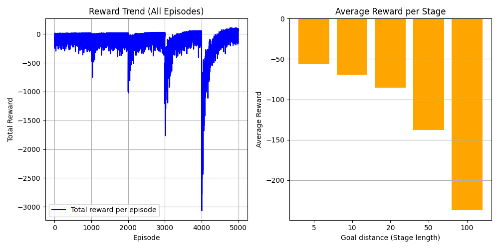

# DQN × カリキュラム学習

## 概要

このプロジェクトでは、**強化学習（DQN）** を用いて  
「直線のセカイ（LineWorld）」におけるエージェントの行動学習を行いました。

カリキュラム学習（Curriculum Learning）を導入し、  
**簡単な環境から徐々に難しい環境へ** とタスクを発展させました。

## 環境の説明

### 直線のセカイ（LineWorld）

- エージェントは 1 次元上を左右に移動します。  
- 左に戻ると報酬 -1。  
- 行動は2種類：
  - `0`：左に移動  
  - `1`：右に移動  

## 学習設定

### DQNAgent
- モデル構造：`nn.Linear(1, 32)` → `ReLU` → `nn.Linear(32, 3)`
- オプティマイザ：Adam (`lr=1e-3`)
- 割引率：`γ = 0.99`
- ε-greedy による探索 (`ε` は徐々に減衰)

### カリキュラム設定
- ステージ（ゴール距離）を順に拡大  
- 各ステージ終了後に target network を同期

## 結果

### カリキュラム学習を実施した場合

### カリキュラム学習を実施しなかった場合

最初からタスクに挑戦すると、カリキュラム学習を実施した時より、報酬が安定しませんでした。

